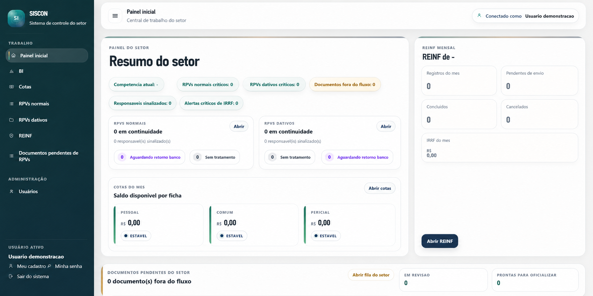
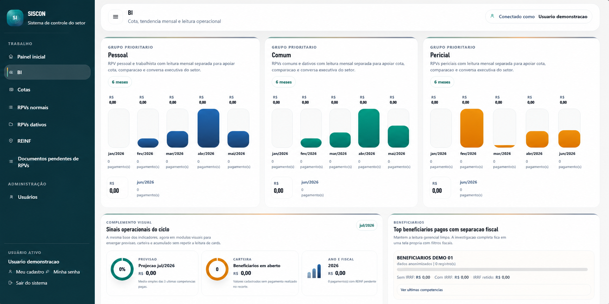

# SISCON Controle de RPVs

Aplicacao web Flask para controle operacional e financeiro de `RPVs`, `dativos`, `cotas mensais`, `REINF` e `BI operacional`.

Este repositorio e a camada publica e sanitizada do produto. Ele foi preparado para portfolio tecnico, demonstrando arquitetura, qualidade de codigo, organizacao de produto e disciplina operacional sem expor banco real, planilhas, backups, certificados, segredos ou documentos internos.

## Visao geral

O sistema nasceu para substituir controles dispersos em planilhas e verificacoes manuais por uma aplicacao com:

- rastreabilidade de alteracoes
- validacao de regras de negocio
- leitura gerencial por modulo
- separacao segura entre codigo e dados sensiveis

## O que este repositorio demonstra

- monolito modular em Flask com crescimento controlado
- dominio real de `RPVs`, `dativos`, `cotas`, `REINF` e `BI`
- separacao entre `routes`, `services`, `models`, `templates` e `tests`
- evolucao de schema via Alembic
- regras financeiras e fiscais com `Decimal`
- auditoria de alteracoes sensiveis
- healthcheck operacional e observabilidade local
- scripts Windows para execucao, backup e publicacao segura
- suite automatizada com `268` testes passando na sincronizacao desta copia

## Principais modulos

- `RPVs normais`: cadastro, lista, filtros, pendencias e cruzamentos
- `RPVs dativos`: `C.I.`, lotes, itens, conciliacao e revisao operacional
- `Cotas`: saldo mensal por ficha, consumo, transferencia e historico
- `REINF`: recortes mensal/anual, conferencia fiscal e exportacao
- `BI`: leitura executiva, series operacionais, beneficiarios e filtros
- `Usuarios e seguranca`: login, troca de senha, recuperacao e perfis

## Estado arquitetural atual

O projeto evoluiu para um patamar mais profissional sem reescrita grande. As melhorias mais relevantes desta fase publica foram:

- modularizacao do `BI` em servicos dedicados
- modularizacao de `dativos`, `REINF` e lista principal de `RPVs`
- entrada do modulo de `cotas` no fluxo arquitetural consolidado
- separacao progressiva da suite por dominio
- endurecimento da camada operacional para crescimento futuro
- reforco da governanca entre `dev`, `runtime` e espelho publico

## Screenshots

As capturas demonstrativas devem ficar em [`docs/screenshots/`](docs/screenshots/README.md).

Orientacao desta camada publica:

- usar apenas dados anonimizados ou ficticios
- zerar valores, contagens e KPIs quando a captura nao precisar demonstrar volume
- ocultar nomes pessoais, documentos e identificadores internos
- nao exibir barra do navegador, URL, hostname, query string ou caminho de rota
- preservar o layout real da interface
- evitar blur pesado, tarjas pretas ou edicao com cara artificial

Capturas recomendadas:

1. `dashboard-home-clean.png`
2. `bi-operacional-clean.png`
3. `cotas-clean.png`

Capturas demonstrativas desta copia publica:

- usam dados ficticios ou anonimizados
- trazem valores e indicadores zerados intencionalmente
- nao exibem URL, rota real, hostname, query string ou identificador operacional interno
- seguem uma politica conservadora de seguranca da informacao e adequacao a LGPD

### Painel inicial



### BI operacional



## Qualidade e validacao

Na sincronizacao desta copia publica, a validacao considerada foi:

```text
268 testes automatizados passando
python -m compileall app tests -q sem erro
varredura de seguranca sem banco real, instance, .env real, backups ou docs privados rastreados
```

## Estrutura

```text
app/                   aplicacao Flask
migrations/            historico Alembic
tests/                 testes automatizados
docs/                  documentacao publica do portfolio
run.py                 entrada Flask
serve_local.py         servidor HTTP local
serve_https_local.py   servidor HTTPS local
```

## Como rodar localmente

```powershell
python -m venv .venv
.\.venv\Scripts\Activate.ps1
pip install -r requirements.txt
Copy-Item .env.example .env
$env:FLASK_APP = "run.py"
flask db upgrade heads
flask seed-data
python serve_local.py
```

Endereco padrao:

```text
http://127.0.0.1:8080/login
```

Para HTTPS local:

```powershell
.\iniciar_servidor_https_local.ps1 -Port 8445 -ForceCert
```

## Testes

```powershell
python -m pytest -q tests
```

## Documentacao publica

- [Indice da documentacao](docs/README.md)
- [Arquitetura](docs/ARCHITECTURE.md)
- [Funcionalidades](docs/FEATURES.md)
- [Seguranca](docs/SECURITY.md)
- [Setup local](docs/SETUP.md)
- [Notas de portfolio](docs/PORTFOLIO.md)
- [Guia de screenshots](docs/screenshots/README.md)

## Higiene de publicacao

Este repositorio deve permanecer sem:

- bancos SQLite reais
- pasta `instance/`
- backups
- planilhas e PDFs operacionais
- `.env` real
- certificados e chaves locais
- material juridico, negocial ou privado

As imagens publicadas nesta camada tambem devem permanecer sem:

- dados pessoais reais
- dados operacionais reais
- identificadores internos ou documentos reais
- rotas internas ou evidencias de infraestrutura

## Autor

Gabriel Bomfim Bispo
